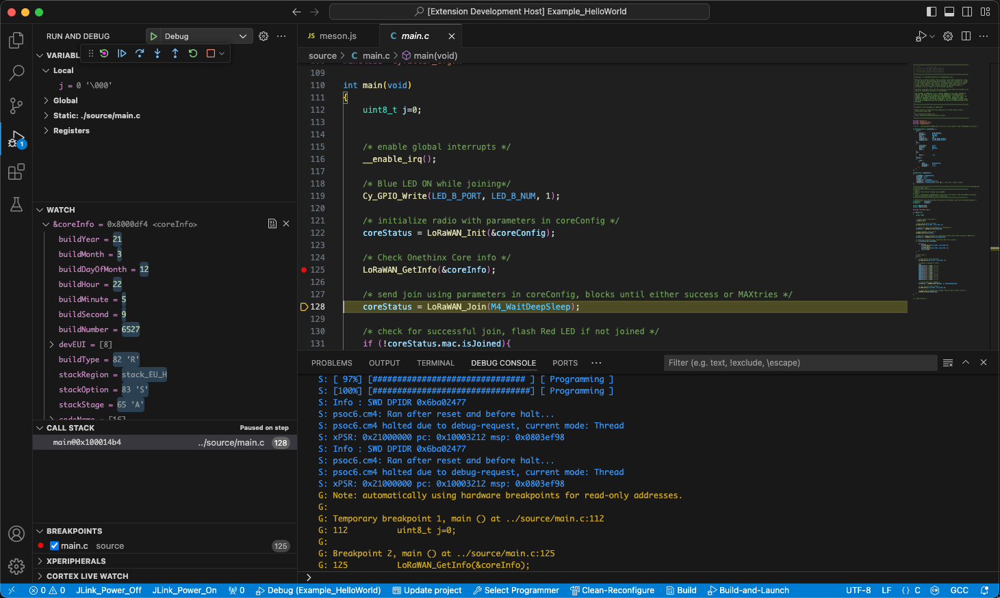

# Cortex GDB

Debugging support for ARM Cortex-M Microcontrollers.

Forked from [the Cortex-Debug repository of Marus Ball](https://github.com/Marus/cortex-debug)

Additional features:
- Programming info (prelaunch) forwarded to Debug Console
- GDB Port configurable

## Acknowledgments
Big thanks to the contributing developers at Marus Ball's repository. 
